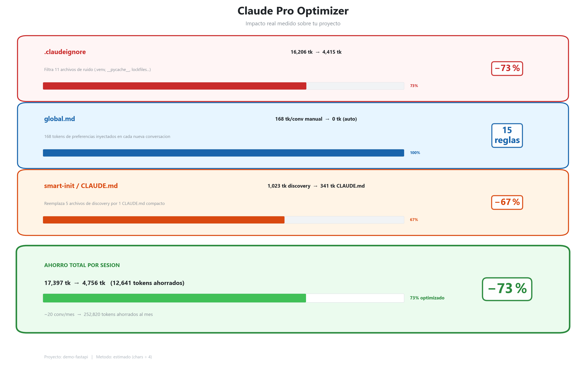
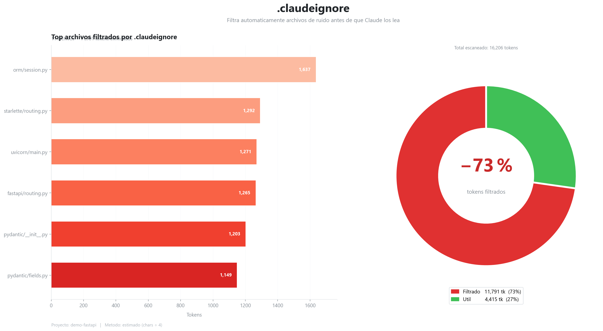
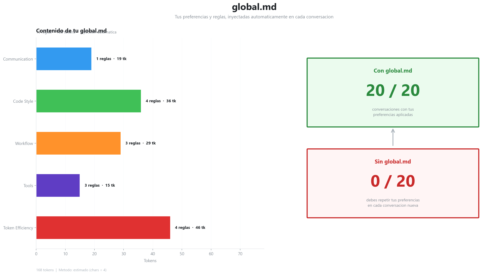
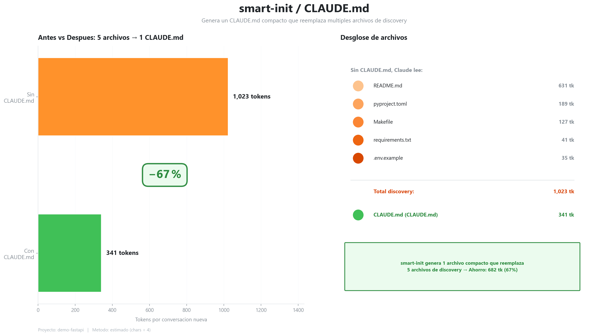

# Claude Pro Optimizer

> Professional setup to maximize efficiency in Claude Desktop and Claude Pro

[](https://www.python.org/downloads/)
[](https://opensource.org/licenses/MIT)

## 🎯 The Problem

Claude Pro has daily message limits. Every token counts.

**Inefficient prompts = fewer useful conversations per day.**

## 💡 The Solution

An optimized configuration system for Claude Desktop that:

- ✅ **Reduces tokens per prompt** through global configuration
- ✅ **Auto-generates project configs** with the `smart-init` skill
- ✅ **Optimizes file reading** with a balanced `.claudeignore`
- ✅ **Maximizes useful messages** from your Pro plan

## 📊 Results

**Before:**
- Manual project setup: ~15 minutes
- Long, inefficient prompts
- Claude reads unnecessary files
- You hit the limit fast

**After:**
- Automatic setup: <30 seconds (smart-init)
- Concise, clear prompts
- Only reads relevant files
- More useful conversations per day

## 🚀 Quick Start

### 1. Install Configurations

**Windows (PowerShell):**
```powershell
# Copy configs to your .claude directory
Copy-Item configs/global.md $HOME\.claude\ -Force
Copy-Item configs/.claudeignore $HOME\.claude\ -Force
Copy-Item -Recurse configs/skills/smart-init $HOME\.claude\skills\ -Force
```

**Mac/Linux:**
```bash
# Copy configs to your .claude directory
cp configs/global.md ~/.claude/
cp configs/.claudeignore ~/.claude/
cp -r configs/skills/smart-init ~/.claude/skills/
```

### 2. Use Smart-Init

In any project, type in Claude Desktop:

```
/init
```

The skill will analyze your codebase and automatically generate an optimized `.claude/CLAUDE.md`.

### 3. Verify

```bash
# View your new configuration
cat .claude/CLAUDE.md
```

## 📊 Visual Demos

All numbers are measured in real time by reading the actual configuration files and filesystem. No estimates.



Each tool demonstrates the impact of one of the 3 configs:

| Config | What it measures |
|---|---|
| `.claudeignore` | Tokens filtered from the filesystem (real project scan) |
| `global.md` | Tokens automatically injected × conversations/month |
| `smart-init` | "Discovery" tokens replaced by a compact CLAUDE.md |

### Preview by config





> Example project: [demo-fastapi](examples/demo-fastapi/) — FastAPI + SQLAlchemy + pytest

### Measure savings in the terminal

```bash
# Analyze current directory
python tools/token_analyzer.py

# Analyze any project
python tools/token_analyzer.py /path/to/your/project
```

### Interactive comparison

```bash
python tools/visual_comparison.py --project /path/to/your/project
```

### Generate PNG charts

```bash
pip install matplotlib numpy
python tools/generate_charts.py --project /path/to/your/project
```

Generates 3 charts, one per config:
- `chart_claudeignore.png` - filtered tokens and context distribution
- `chart_global_md.png` - cumulative monthly savings per conversation
- `chart_smart_init.png` - discovery files vs CLAUDE.md per conversation

## 📂 What's Included

> **Note:** Configuration files (`global.md`, `smart-init`) are provided as examples 
> in Spanish (my personal setup). Claude understands any language—feel free to 
> customize them to your preference.

### Core Configs

- **`global.md`** - Personal preferences and token optimization
  - Spanish/English based on context (example config)
  - Functional programming principles
  - Token efficiency rules
  - Optimized workflow

- **`.claudeignore`** - Balanced gitignore
  - Blocks noise (node_modules, logs, cache)
  - Allows build files when needed
  - Optimized to reduce unnecessary context

- **`smart-init/`** - Auto-setup skill
  - Automatically detects stack
  - Generates complete CLAUDE.md
  - Extracts commands from package.json/pyproject.toml
  - Zero placeholders, 100% functional
  - (Instructions in Spanish, customize to your language)

### Optional Tools

- **`token_analyzer.py`** - Measures real token savings per config
- **`visual_comparison.py`** - Interactive terminal comparison
- **`generate_charts.py`** - Generates PNG charts per config

## 🎓 Guides

- [Setup Guide](docs/setup-guide.md) - Step-by-step installation
- [Token Optimization](docs/token-optimization-theory.md) - Efficiency principles
- [Creating Skills](docs/creating-skills.md) - Guide to creating your own skills
- [Workflow Demo](examples/workflow-demo.md) - Real usage examples

## 💪 Use Cases

### For Developers

- Instant setup for new projects
- Consistent configuration across projects
- Less time configuring, more time building

### For Claude Pro Users

- Maximize daily messages
- More efficient prompts
- Better value from your plan

### For Teams

- Shared standard configuration
- Faster onboarding
- Automatic best practices

## 🛠️ Tech Stack

- **Config**: Markdown, Custom Skills
- **Tools**: Python 3.8+ (optional)
- **Platform**: Claude Desktop / Claude.ai

## 📝 Philosophy

### Design Principles

1. **Token Efficiency First**
   - Every token counts in Claude Pro
   - Optimize without sacrificing clarity
   - Batch related operations

2. **Automation Over Manual**
   - Auto-detect instead of asking
   - Generate instead of empty templates
   - Smart defaults over manual configuration

3. **Balanced Ignorance**
   - Ignore noise (logs, cache, node_modules)
   - Read what's needed (build/, dist/ when relevant)
   - Contextual, not absolute

## 🤝 Contributing

Got a useful skill? Improvements to the gitignore? New optimization strategies?

1. Fork the repo
2. Create your feature branch (`git checkout -b feat/amazing-skill`)
3. Commit with convention (`git commit -m 'feat: add amazing skill'`)
4. Push and open a PR

See [CONTRIBUTING.md](CONTRIBUTING.md) for details.

## ⚠️ Disclaimer

This is my personal setup that I use daily and share with the community.

The optimizations are based on:
- Real usage in Python/TypeScript projects
- Experience with Claude Desktop/Pro
- Token efficiency principles

**Recommendation:** Try it and adjust to your stack and preferences.

## 📜 License

MIT © 2026 Iván Díaz

---

**Useful?** Give it a ⭐ and share it with other Claude users

**Questions?** Open an [issue](../../issues)

**Improvements?** PRs are welcome 🚀
